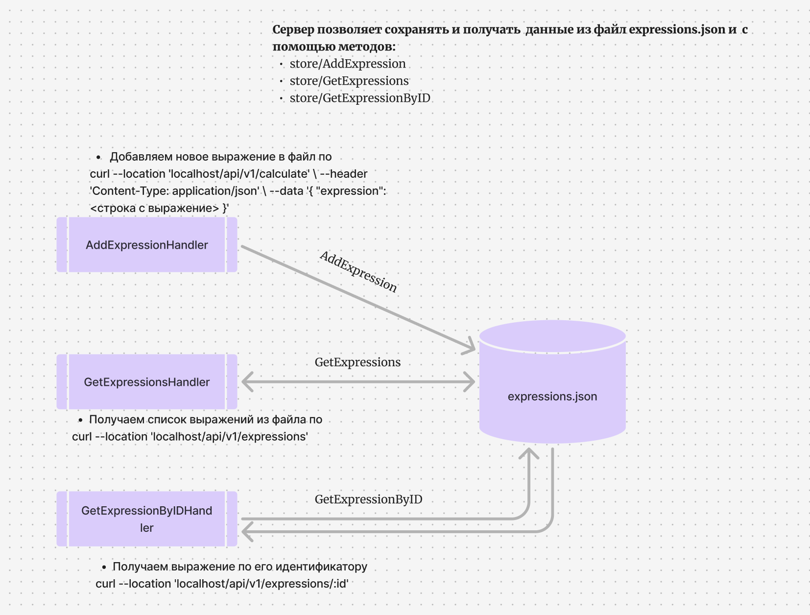

# Server Calculate



## Веб - сервис для вычисления арифметических выражений:

- [X]  сложения;
- [X]  вычитания;
- [X]  деления;
- [X]  умножения;

## 

# Для запуска сервера необходимо:

1. Клонировать репозиторий
   ---------------------------------------------

https://github.com/heenimm/srvrClct.git

### Установить зависимости:

go mod download

2. Запустить сервис командой
   ------------------------------------------------

```
 export PORT=8082 COMPUTING_POWER=5 && go run ./cmd/main.go
```

## ////////////////////////////////////////////////////////////////////////////

## ВАЖНО: После успешного запуска сервера надо открыть новый терминал и ввести следующие CURL, для проверки корректной работы////////////////////////////////////////////////////////////////////////////

# API

Перед использованием необходимо зарегистрироваться

```
curl -X POST http://localhost:8082/api/v1/register -H "Content-Type: application/json" -d '{"login":"tester","password":"secret123"}'
```

После залогиниться и получить свой токен

```
curl -X POST http://localhost:8082/api/v1/login -H "Content-Type: application/json" -d '{"login":"tester","password":"secret123"}'

```

## Все возможности сервиса доступны только зарегистрированным пользователям

# Три внешних хендлера:

* Добавление вычисления арифметического выражения
  ```
  curl -X POST http://localhost:8082/api/v1/calculate \
  -H "Content-Type: application/json" \
  -H "Authorization: Bearer your_jwt_token_here" \
  -d '{"expression": "3 + 5"}'

  ```

Коды ответа: 201 - выражение принято для вычисления, 422 - невалидные данные, 500 - что-то пошло не так

Тело ответа

```
{
    "id": <уникальный идентификатор выражения>
}
```

* Получение списка выражений
  ```
  curl --location 'localhost:8082/api/v1/expressions' \
  -H "Authorization: Bearer your_jwt_token_here"

  ```

Тело ответа

```
{
    "expressions": [
        {
            "id": <идентификатор выражения>,
            "status": <статус вычисления выражения>,
            "result": <результат выражения>
        },
        {
            "id": <идентификатор выражения>,
            "status": <статус вычисления выражения>,
            "result": <результат выражения>
        }
    ]
}
```

Коды ответа:

* 200 - успешно получен список выражений
* 500 - что-то пошло не так
* Получение выражения по его идентификатору
  ```
  curl --location 'localhost:8082/api/v1/expressions/:id' \
  -H "Authorization: Bearer your_jwt_token_here"

  ```

Коды ответа:

* 200 - успешно получено выражение
* 404 - нет такого выражения
* 500 - что-то пошло не так

Тело ответа

```
{
    "expression":
        {
            "id": <идентификатор выражения>,
            "status": <статус вычисления выражения>,
            "result": <результат выражения>
        }
}
```

## и два внутренних хендлера для общения оркестратора и агента:

* Получение задачи для выполнения
  ```
  curl --location 'localhost:8082/internal/task'
  ```

Коды ответа:

* 200 - успешно получена задача
* 404 - нет задачи
* 500 - что-то пошло не так

Тело ответа

```
{
    "task":
        {
            "id": <идентификатор задачи>,
            "arg1": <имя первого аргумента>,
            "arg2": <имя второго аргумента>,
            "operation": <операция>,
            "operation_time": <время выполнения операции>
        }
}
```

* Прием результата обработки данных.
  ```
  curl --location 'localhost:8082/internal/task' \
  --header 'Content-Type: application/json' \
  --data '{
    "id": 1,
    "result": 2.5
  }'
  ```

Коды ответа:

* 200 - успешно записан результат
* 404 - нет такой задачи
* 422 - невалидные данные
* 500 - что-то пошло не так

## Агент запускается при старте сервера (метод worker) и просит задачу запрос GetTasksHandler


Порядок работы:
Сначала пользователь должен зарегистрироваться, отправив запрос на эндпоинт /api/v1/register с логином и паролем. А после регистрации войти под своим логином и паролем по эндпоинту /api/v1/login и получить JWT токен для последующего использования при запросах на другие эндпоинты.
При отправке выражения на эндпоинт api/v1/calculate выражение сохраняется в базу данных, парсится на подвыражения и создаются таски, а пользователю возвращается id выражения(calculate_handler). Далее хэндлер GetTask поочередно отправляет таски на эндпоинт internal/task(task_handler). Через этот эндпоинт агент получает по одному таску и добавляет их в канал jobs, после получения всех тасков агент создает определенное количество воркеров, которые получают таск через канал, вычисляют его и отправляют результат в канал results, агент достает результаты из этого канала и отправляет оркестратору по эндпоинту internal/task(agent). Хэндлер PostResult слушает этот эндпоинт, получает результат, добавляет в базу данных, и если все таски выполнены, меняет статус выражения и добавляет итоговый результат.
При запросе на эндпоинт api/v1/expressions возвражается список всех выражений.
При запроосе на эндпоинт api/v1/expressions/{id} возвращается выражение с конкретным id или же ошибка, если оно не найдено.